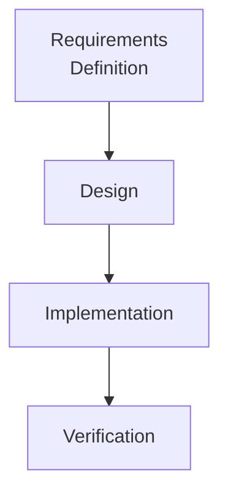
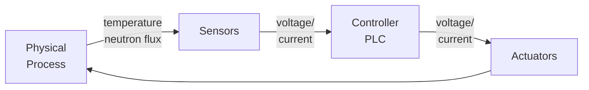

# Introduction to I&C software

## Major Activities

- Requirements Definition
    - What do we want to achieve?
    - define requirements (specifications)
- Design
    - How to achieve?
    - define DSA
    - breakdown into components and their architecture
- Implementation
    - convert design to code
- Verification
    - Is our implementation correct?
    - wrt requirements & design


## Arranging activities

eg. Waterfall model


Freeze an activity before going to next step. Can be used for critical systems, since requirements unlikely to change while developing.


## Instrumentation and control systems



Program pseudocode

```
every 10 ms :
    input_signal <-- read from board
    regulating_signal := compute(input_signal)
    regulating_signal --> output to board
```

### Features

- reactive
    - never terminate
- real time performance requirements
- important to safety
    - failure not acceptable